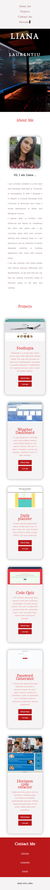
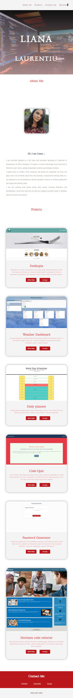
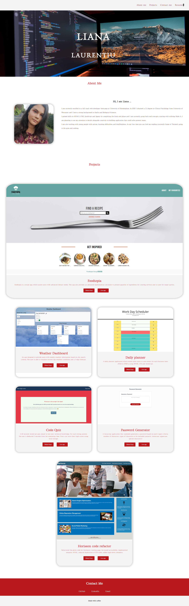

# Personal Portfolio - HTML, CSS

Portfolio showcasing my projects built using HTML5 and CSS3 frameworks.

## Table of Contents

- [Personal Portfolio - HTML, CSS](#personal-portfolio---html-css)
  - [Table of Contents](#table-of-contents)
  - [Description](#description)
  - [Link deployed application](#link-deployed-application)
  - [Technologies used](#technologies-used)
    - [HTML5](#html5)
    - [CSS3](#css3)
  - [Contact Me](#contact-me)
  - [License](#license)
    - [MIT License](#mit-license)
  - [Screenshots application](#screenshots-application)
    - [Small devices](#small-devices)
    - [Medium devices](#medium-devices)
    - [Large devices](#large-devices)

## Description

In this project I built my personal portfolio using HTML and CSS. I included 3 main sections: about me, my projects and my contacts. I also built some animations in CSS, which I am planning to improve once I master JavaScript. In the navbar there is an extra link towards a downloadable version of my resume.

## Link deployed application

Click [here](https://lianavaleria15.github.io/my-portfolio) to view the deployed live application.

## Technologies used

### HTML5

- [x] used semantic elements elements
- [x] added high-level comments
- [x] respected the logical order of the heading elements
- [x] linked navbar links to correspondent webpage sections using id selectors
- [x] added class names to add css style properties

### CSS3

- [x] used css reset stylesheet to overwrite the browser styling properties
- [x] used css variable to group color properties
- [x] used child and class selector properties to apply the styling
- [x] used flexbox property to make the application responsive
- [x] added media queries for different screen sizes, using x-small, small, medium, large and x-large viewport breakpoints
- [x] used `@keyframes` property to add animations for headings on top of banner image (transitions from left and right) and the projects cards (grow card size, when hovered over)
- [x] used pseudo-class `:first-child` to apply larger size property on the first project card

## Contact Me

## License

### MIT License

Copyright (c) 2021 Liana-Valeria Laurentiu

Permission is hereby granted, free of charge, to any person obtaining a copy
of this software and associated documentation files (the "Software"), to deal
in the Software without restriction, including without limitation the rights
to use, copy, modify, merge, publish, distribute, sublicense, and/or sell
copies of the Software, and to permit persons to whom the Software is
furnished to do so, subject to the following conditions:

The above copyright notice and this permission notice shall be included in all
copies or substantial portions of the Software.

THE SOFTWARE IS PROVIDED "AS IS", WITHOUT WARRANTY OF ANY KIND, EXPRESS OR
IMPLIED, INCLUDING BUT NOT LIMITED TO THE WARRANTIES OF MERCHANTABILITY,
FITNESS FOR A PARTICULAR PURPOSE AND NONINFRINGEMENT. IN NO EVENT SHALL THE
AUTHORS OR COPYRIGHT HOLDERS BE LIABLE FOR ANY CLAIM, DAMAGES OR OTHER
LIABILITY, WHETHER IN AN ACTION OF CONTRACT, TORT OR OTHERWISE, ARISING FROM,
OUT OF OR IN CONNECTION WITH THE SOFTWARE OR THE USE OR OTHER DEALINGS IN THE
SOFTWARE.

## Screenshots application

### Small devices

### Medium devices

### Large devices

