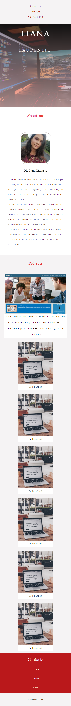
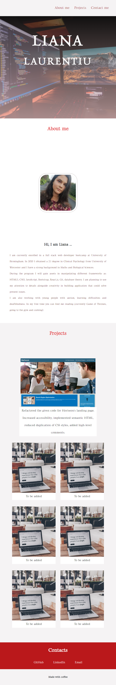
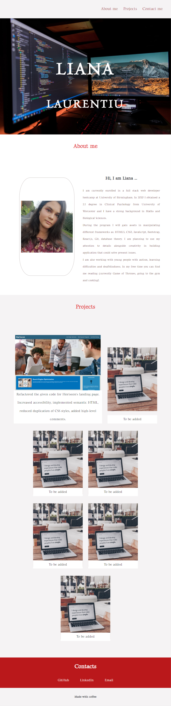
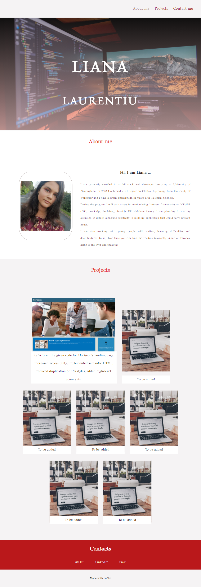
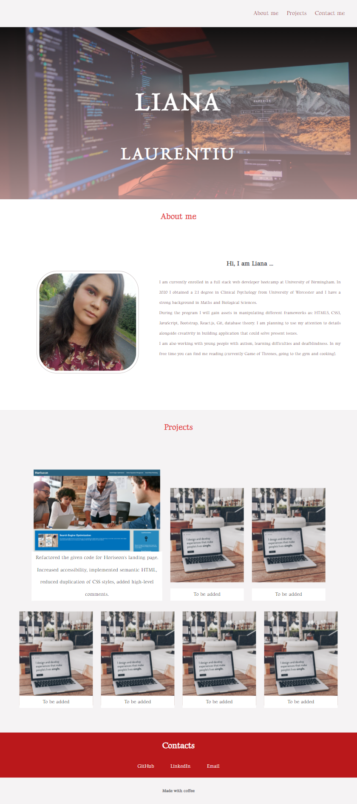

# Personal Portfolio - HTML, CSS

Portfolio showcasing my projects built using HTML5 and CSS3 frameworks.

## Description

In this project I built my personal portfolio using HTML and CSS. I included 3 main sections: about me, my projects and my contacts. I also built some animations in CSS, which I am planning to improve once I master JavaScript.

## Link deployed application

Click [here](https://lianavaleria15.github.io/my-portfolio) to view the deployed live application.

## Technologies used

### HTML5

- [x] used semantic elements elements
- [x] added high-level comments
- [x] respected the logical order of the heading elements
- [x] linked navbar links to correspondent webpage sections using id selectors
- [x] added class names to add css style properties

### CSS3

- [x] used css reset stylesheet to overwrite the browser styling properties
- [x] used css variable to group color properties
- [x] used child and class selector properties to apply the styling
- [x] used flexbox property to make the application responsive
- [x] added media queries for different screen sizes, using x-small, small, medium, large and x-large viewport breakpoints
- [x] used `@keyframes` property to add animations for headings on top of banner image (transitions from left and right) and the projects cards (grow card size, when hovered over)
- [x] used pseudo-class `:first-child` to apply larger size property on the first project card

## Screenshots application

### X-small devices

### Small devices

### Medium devices

### Large devices

### X-large devices

